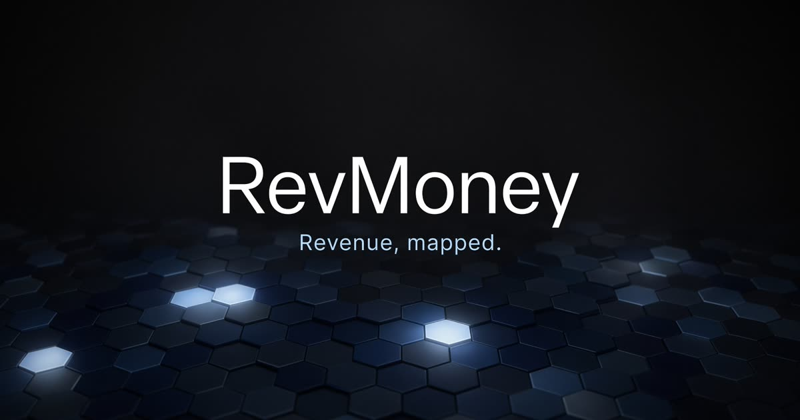
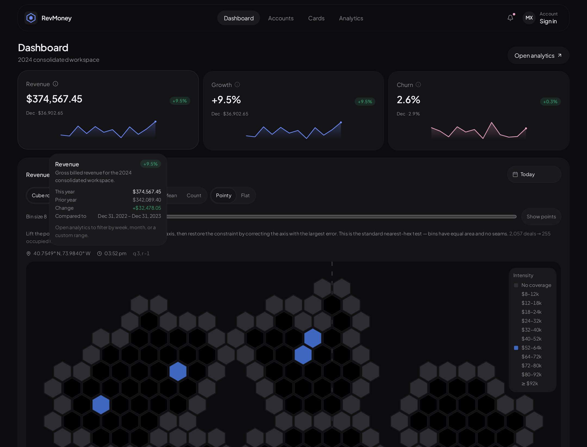
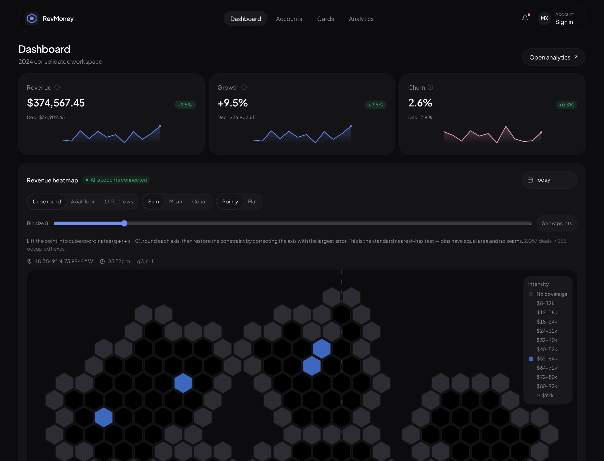
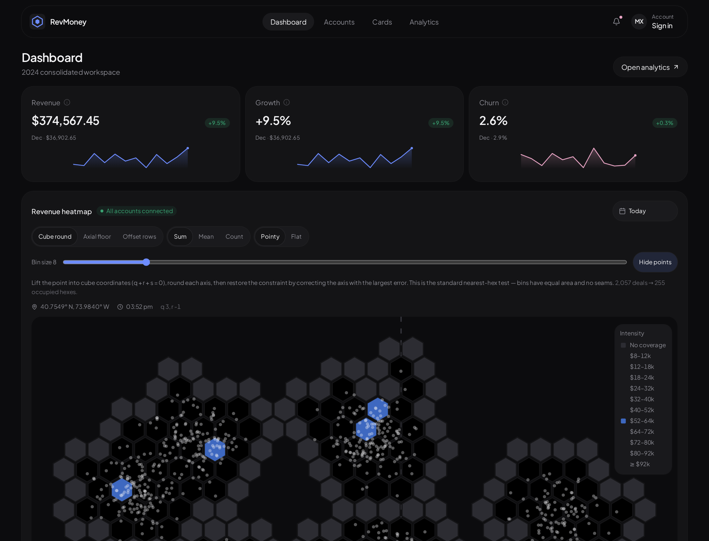

<p align="center">
  
</p>

<h1 align="center">RevMoney</h1>

<p align="center">
  <strong>A product-design exploration of revenue analytics.</strong><br />
  Built as a vibe-coding experiment with Grok — not a production finance product.
</p>

<p align="center">
  <a href="https://karanrevmoney.grok.me"><strong>Live site</strong></a>
  ·
  <a href="https://github.com/Kayariyan28/FinancialDashboardConcept">GitHub</a>
  ·
  Dashboard · Analytics · Honeycomb map
</p>

<p align="center">
  
</p>

---

## Interface

The live product is **RevMoney** — hex mark, charcoal chrome, one blue accent. The frames below are the current interface, not the earlier Monex label.

<p align="center">
  
</p>

Hover a KPI and the definition, prior period, and sparkline arrive in the same card. Leave, and the readout fades — no trapped overlay.

---

## Why this exists

Most financial dashboards start with a chart library and a spreadsheet. This one started as a **design question**:

> If revenue had a geography, what would it feel like to move through it?

RevMoney is a concept surface for that question. It was prototyped end-to-end with **Grok as a vibe-coding partner** — brief, iterate, look, correct, ship. The goal was not to replace a BI stack. The goal was to find a visual language that makes money *spatial*: KPIs you can hover, trends you can scrub, and a honeycomb that treats districts as cells instead of rows.

This repository is the artifact of that exploration.

---

## Design thesis

**1. Numbers should explain themselves.**  
A KPI that only displays a figure is a billboard. Hover (or tap) a card and the definition, prior period, and sparkline come with it. The readout closes when you leave — no trapped overlay, no focus trap.

**2. Geography is a first-class chart.**  
Tables flatten place. A honeycomb keeps neighborhood structure. Hexes tessellate without the dead corners of a square grid, which is why they belong on a city-shaped revenue field.

**3. Algorithms should be visible.**  
The map is not painted. It bins ~2,000 sample deals with cube rounding, axial floor, or D3-style offset rows. Switching the method is part of the product, not a debug panel.

**4. Dark, quiet, one accent.**  
Charcoal ground (`#0c0c0e`), ice-to-navy hex scale, a single blue for income. No decorative gradients. Motion is short and reversible.

---

## What you can do

| Surface | Intent |
| --- | --- |
| **Dashboard** | Year snapshot: revenue, growth, churn — each with a sparkline and a hover definition. |
| **Revenue heatmap** | Honeycomb of binned deals. Hover a cell for district, amount, deal count, and axial `(q, r)`. |
| **Binning explorer** | Cube round · Axial floor · Offset rows. Sum / mean / count. Pointy or flat. Bin size 7–14. Overlay the source points. |
| **Analytics** | Date-range filters (week / month / 90 days / custom / year). Forecast vs actual. Mix, net, and cost breakdowns. |
| **Accounts & cards** | Quiet supporting views so the dashboard doesn’t have to hold every object. |

Sample data is generated in-app. Nothing here is live banking data; the product is meant to work **offline**.

---

## The honeycomb

<p align="center">
  
</p>

Cube rounding is the default nearest-hex test: lift a point into cube coordinates \(q + r + s = 0\), round, then restore the constraint on the axis with the largest error. Equal-area bins, no seams.

Switch to **Axial floor** and the city outline shears — a designed failure, so the cost of the cheap algorithm is visible. **Offset rows** is the D3 hexbin shortcut: close to cube round, cheaper, with a little odd/even drift.

<p align="center">
  
</p>

---

## Interaction notes

A large part of this experiment was **hover craft**.

KPI cards originally used a portaled popover. The panel would appear under a stationary cursor, steal focus, and flicker — a black overlay that wouldn’t leave. The fix was to drop the portal and keep the tip in the card’s hover group: CSS fade/scale, delayed close, no focus trap. Same rule on hex tooltips: they live in the map, not in a layer that fights the pointer.

That is product design, not polish. If a tooltip can’t leave, the interface is lying about control.

---

## Stack

| Layer | Choice |
| --- | --- |
| UI | React 19, TanStack Start, Tailwind v4 |
| Charts | Recharts + custom SVG honeycomb |
| Motion | CSS transitions (`prefers-reduced-motion` respected) |
| Data | Seeded in-memory series (offline demo) |
| Auth | Optional Better Auth (for the scaffold, not the concept) |

This is a **concept**, not a template. Fork it if the honeycomb or the KPI hover pattern is useful. Don’t treat the numbers as advice.

To **rebuild a site of this class** (another product, same interaction quality), load the skill and follow it in order — tokens, KPI hover craft, seeded data, then a honeycomb that actually bins points:

**[`skills/spatial-analytics-platform/SKILL.md`](skills/spatial-analytics-platform/SKILL.md)**

It is written for a designer + an agent: thesis, file map, the hover bug we already paid for, cube / axial-floor / offset-row math, and a paste-ready rebuild prompt. References:

- [`hex-binning.md`](skills/spatial-analytics-platform/references/hex-binning.md) — pixel ↔ axial, cube round, D3 offset
- [`hover-craft.md`](skills/spatial-analytics-platform/references/hover-craft.md) — why portaled tooltips loop, and the CSS fix

---

## View it

**Live:** [karanrevmoney.grok.me](https://karanrevmoney.grok.me)  
**Source:** [github.com/Kayariyan28/FinancialDashboardConcept](https://github.com/Kayariyan28/FinancialDashboardConcept)

Open the live site to hover KPIs, scrub the honeycomb, and switch binning algorithms. No install required.

---

## Run locally

```bash
npm install
npm run dev
```

The app listens on `http://localhost:8080`.

```bash
npm run typecheck
```

---

## What this is not

- Not a bank, broker, or accounting system.
- Not production-ready auth, billing, or data pipelines.
- Not a claim that vibe coding replaces design process — it compressed the *making*. Critique, hierarchy, and the hex-binning brief still came from a designer’s intent.

---

## Process

Designed and built with [Grok](https://grok.com) as a pair: short briefs, live preview, visual QA, then correction. The interesting work was the back-and-forth — KPI hover that wouldn’t close, a honeycomb that had to match a reference, binning algorithms that had to be *shown*, not described.

The rebuild skill above is that loop, written down so it can be run again on a different brand.

If you are exploring the same loop (product design × generative coding), this repo is a snapshot of what that can look like on a financial surface.

<p align="center">
  
</p>

<p align="center"><sub>RevMoney · K28 Design Lab · 2026</sub></p>
